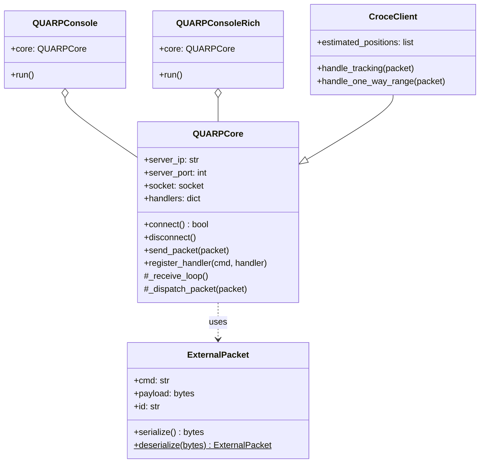
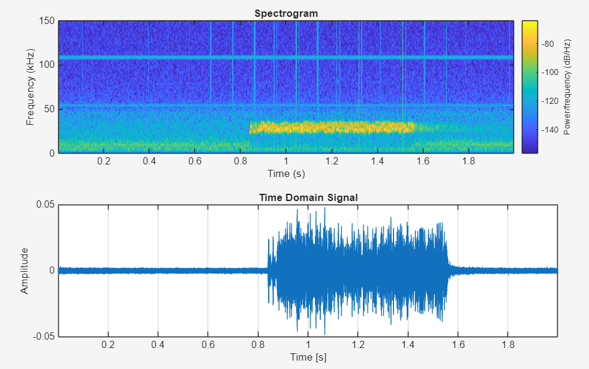

# QUARP Client - Underwater Development Platform

<p align="center">
  
  
  
  
</p>

QUARP is a comprehensive client framework designed for an underwater development platform, featuring acoustic communication and Long Baseline (LBL) tracking capabilities. It provides a robust core for handling network communications and multiple client implementations tailored for different functionalities, from basic modem communication to real-time signal visualization and complex trilateration.

## 📦 Requirements & Dependencies

### Python
The Python client framework requires **Python 3.8+**. The following external packages are needed:
*   `numpy`: General numerical operations and array handling.
*   `scipy`: Signal processing algorithms (e.g., generating spectrograms in the hydrophone client).
*   `pyqtgraph` & `PyQt5`: Required for the high-performance real-time GUI in the hydrophone client.
*   `rich`: Required for the enhanced terminal interface in the rich CLI client.

You can install the dependencies via `pip`:
```bash
pip install numpy scipy pyqtgraph PyQt5 rich
```

### MATLAB
To run the visualization scripts (e.g., `recording_visualizer.m`):
*   **MATLAB R2020a or newer** (recommended for `tiledlayout` plotting).
*   **Signal Processing Toolbox**: Required for functions like `spectrogram`, `blackmanharris`, and `resample`.

## 🏗 Architecture & Client Structure

The architecture is built around a central `client` Python module that separates core communication logic from user interfaces and specific data processing tasks.

### Core Components

*   **`client.core.QUARPCore`**: The heart of the framework. It manages the TCP connection to the server/modem, handles the serialization/deserialization of packets, and dispatches incoming messages to registered handlers. It contains pure logic and does not handle user input or console outputs.
*   **`client.interface.ExternalPacket`**: Defines the structure of the data packets exchanged with the modem. It handles the JSON serialization and includes fields like `cmd`, `payload`, `time_stamp`, `snr`, and tracking-specific data (`tracking_shifts`, `tracking_factors`, `yaw`, `pitch`, `roll`).
*   **`client.cli.QUARPConsole`** & **`client.cli_rich.QUARPConsoleRich`**: View/Controller classes that wrap the core to provide interactive command-line interfaces for the user.

### Class Diagram



---

## 🚀 Client Examples

The project includes four distinct client examples demonstrating how to use and extend the framework for various use cases.

### 1. Standard CLI Modem Client (`client_cli.py`)
A basic, lightweight command-line interface client. It instantiates the standard `QUARPConsole` and allows the user to interactively send standard modem commands, configure transmission levels, and exchange messages.

#### ⌨️ Available CLI Commands
*Type `help [command]` in the console for exact regex syntax.*

| Command | Arguments | Description |
| :--- | :--- | :--- |
| **`help`** | `[command]` | Show the list of available commands or detailed syntax for a specific command. |
| **`send`** | `[data]` | Send a data packet with the specified payload. |
| **`sttl`** | `0-3` | Set the transmission level. |
| **`gttl`** | *(none)* | Get the current transmission level. |
| **`stsc`** | `0-3` | Set the channel to use for synchronization. |
| **`gtsc`** | *(none)* | Get the index of the channel in use for synchronization. |
| **`stdc`** | `0-3` | Set the channel to use for demodulation. |
| **`gtdc`** | *(none)* | Get the index of the channel in use for demodulation. |
| **`stvl`** | `0.0-1.0` | Set the transmission volume level. |
| **`gtvl`** | *(none)* | Get the current transmission volume level. |
| **`strl`** | `0.0-1.0` | Set the reception volume level. |
| **`gtrl`** | *(none)* | Get the current reception volume level. |
| **`stc1`** | `0.0-1.0` | Set the correlation threshold for the first encounter. |
| **`gtc1`** | *(none)* | Get the current correlation threshold for the first encounter. |
| **`stc2`** | `0.0-1.0` | Set the correlation threshold for the second encounter. |
| **`gtc2`** | *(none)* | Get the current correlation threshold for the second encounter. |
| **`stmd`** | `mode [node_id]` | Set internal mode: `0` (Modem), `1 <node_id>` (Pinger), `2` (Hydrophone USB). |
| **`slog`** | `on/off` | Turn the logging mode on or off. |
| **`stbr`** | `[value]` | Start a Bit Error Rate (BER) test. |

### 2. Rich CLI Modem Client (`client_cli_rich.py`)
An enhanced version of the CLI client that utilizes the `rich` Python library. It provides a more visually appealing terminal interface with colors and better formatting while maintaining the same underlying modem interaction capabilities.

### 3. Hydrophone Real-Time Viewer (`client_hydrophone.py`)
A sophisticated GUI application built with PyQtGraph for real-time acoustic signal monitoring.

<div align="center">
  
  <br/>
  <em>Example of the Hydrophone Real-Time Viewer</em>
</div>

*   **Data Stream**: Listens on a high-speed UDP port for raw audio samples while maintaining a TCP control connection via `QUARPCore`.
*   **Visualization**: Displays a live oscilloscope (time domain) and a scrolling spectrogram (frequency domain).
*   **Features**: Includes a customizable amplitude trigger mechanism (rising/falling slope) to capture specific acoustic events and a recording feature to save the incoming audio stream directly to `.wav` files.

### 4. LBL Tracking & Trilateration Client (`client_lbl.py`)
A specialized client designed for Long Baseline (LBL) tracking, referred to as the "Croce" analysis.
*   **Core Extension**: It subclasses `QUARPCore` into `CroceClient` to register custom handlers for tracking (`FE_TRACKING_CMD`) and one-way ranging (`FE_ONE_WAY_RANGE_CMD`) packets.
*   **Processing**: Computes Time Difference of Arrival (TDOA) and Angle of Arrival (AoA), estimates the source position via Least Squares trilateration, and compensates for the platform's tilt (yaw/pitch/roll).
*   **Logging**: Automatically logs all calculated positions, distances, and tracking data into structured JSONL files (`tracking_data.jsonl` and `ranging_data.jsonl`) for post-processing.

---

## 📊 MATLAB Visualization

Alongside the Python client structure, the repository includes MATLAB scripts for post-processing and detailed data analysis.

### `matlab/recording_visualizer.m`
This script is designed to visualize the acoustic data saved (e.g., `.wav` files generated by the Hydrophone Client).

<div align="center">
  
  <br/>
  <em>Synchronized Spectrogram and Time Domain Signal in MATLAB</em>
</div>

*   **Functionality**: It loads the audio samples and processes them in moving windows.
*   **Plotting**: Generates a synchronized tiled layout containing:
    1.  A high-resolution **Spectrogram** to analyze frequency content over time.
    2.  The **Time Domain Signal** plot, perfectly aligned with the spectrogram's time axis.
*   **Usage**: Ideal for detailed inspection of sea trial recordings, verifying chirp patterns, and analyzing background noise levels.
